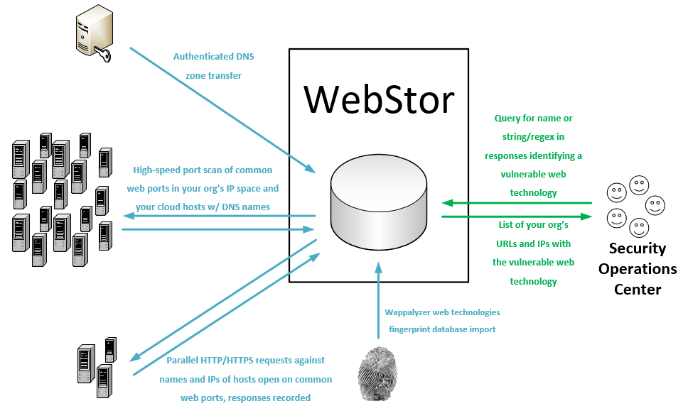

    

&nbsp;

WebStor
=======

## Fast Identification of Vulnerable Web Technologies in your Organization

WebStor is a tool implemented in Python under the MIT license for quickly 
enumerating all websites across all of your organization's networks, storing 
their responses, and querying for known web technologies and versions, such as 
those with zero-day vulnerabilities. It is intended, in particular, to solve 
the unique problem presented in mid to large sized organizations with 
decentralized administration, wherein it can be almost impossible to track 
all of the web technologies deployed by various administrators distributed 
across different units and networks.

WebStor achieves its goal by performing the following actions:
1. Performs DNS zone transfers to collect an organization's A and CNAME 
   records.
2. Uses Masscan to scan for open HTTP/HTTPS ports on an organization's net 
   ranges, as well as any IP addresses outside those ranges that were present 
   in the organization's A and CNAME records.
3. Uses the Python requests library to collect all responses and store in a 
   MariaDB database. All DNS names corresponding to an IP with open HTTP/HTTPS 
   ports will be included in requests in addition to the IP address, so that 
   sites using different headers will not cause a website to be missed.
4. Downloads Wappalyzer web technologies database and stores in MariaDB 
   database, enabling users to query the location(s) of a common web technology 
   by name.
5. Allows users to query the location(s) where custom regexes are contained 
   within stored responses.

## Supported platforms
WebStor presently will run on Linux systems. As it is written in Python, 
conversion to support Windows would be trivial and is likely to happen in the 
future.

## Prerequisites
### Applications
  * Masscan
    - **If you will be using a cron job to update the database (typical), it is 
      critical that you configure sudo nopasswd for any user executing Masscan
      scanning via WebStor.**
  * MariaDB 10.0.5 or later
    - The default credentials tried by WebStor will be root and a blank password.
      See the "Secure options" section for configuring WebStor to use other
      usernames and passwords to connect to the database.

### Python libraries
  * pip3 install dnspython
  * pip3 install beautifulsoup4
  * pip3 install mysql-connector-python
  * pip3 install js-regex
  * pip3 install gevent
  * pip3 install requests 

### Availability via PyPI
  * If you are simply looking to run WebStor and not edit it, you may install the
    prerequisite applications and then use 'sudo pip3 install webstor'.
  * After installing WebStor via PyPI, webstor will be in the path and can be run 
    with at the command line regardless of working directory with 'webstor' 
    instead of 'webstor.py', e.g. 'webstor -g'.  

## Basic usage
~~~
       webstor.py [-h] [--ADD-HTTP-PORT HTTPPORTTOADD] [--CLEAR-HTTP]
                  [--ADD-HTTPS-PORT HTTPSPORTTOADD] [--CLEAR-HTTPS]
                  [--ADD-CUSTOM-FINGERPRINT FINGERPRINT]
                  [--DELETE-CUSTOM-FINGERPRINT FINGERPRINTNAMETODELETE]
                  [--IMPORT-CUSTOM-FINGERPRINT IMPORTFINGERPRINTFILE]
                  [--CLEAR-CUSTOM-FINGERPRINTS] [--SHOW-CONFIG]
                  [--SHOW-CONFIG-FULL] [--RUN-MASSCAN]
                  [--SET-MASSCAN-RANGES SETSCANRANGES]
                  [--IMPORT-MASSCAN-RANGES IMPORTSCANRANGES]
                  [--DELETE-RANGE RANGETODELETE] [--ADD-PATH PATHTOADD]
                  [--DELETE-PATH PATHTODELETE] [--CLEAR-PATHS]
                  [--REFRESH-RESPONSES] [--SEARCH-PATTERN SEARCHPATTERN]
                  [--SEARCH-CUSTOM-FINGERPRINT SEARCHFINGERPRINT]
                  [--SEARCH-WAPPALYZER SEARCHWAPPALYZER] [--NO-TSIG-KEY]
                  [--TSIG-KEY-IMPORT IMPORTTSIGFILE]
                  [--TSIG-KEY-REPLACE REPLACEMENTTSIGFILE]
                  [--DELETE-TSIG TSIGTODELETE]
                  [--USE-TSIG-FILE-ONLY USETSIGFILEONLY]
                  [--DOWNLOAD-NEW-WAPPALYZER] [--LIST-WAPPALYZER-TECH-NAMES]
                  [--ZONE-XFER] [--ADD-DOMAIN DOMAINDETAILS]
                  [--DELETE-DOMAIN DOMAINTODELETE]
                  [--IMPORT-ZONE-FILE IMPORTZONEFILE] [--CLEAR-DOMAINS]
                  [--LIST-DOMAINS] [--LIST-OUTSIDE] [--SQL-CREDS SQLCREDSFILE]

optional arguments:
  -h, --help            show this help message and exit
  --ADD-HTTP-PORT HTTPPORTTOADD, -a HTTPPORTTOADD
                        Add a custom HTTP port.
  --CLEAR-HTTP, -aC     Clear any custom HTTP ports and revert to default of
                        80.
  --ADD-HTTPS-PORT HTTPSPORTTOADD, -b HTTPSPORTTOADD
                        Add a custom HTTPS port.
  --CLEAR-HTTPS, -bC    Clear any custom HTTPS ports and revert to default of
                        443.
  --ADD-CUSTOM-FINGERPRINT FINGERPRINT, -c FINGERPRINT
                        Add a custom fingerprint in the form <Name>,<RegEx>.
  --DELETE-CUSTOM-FINGERPRINT FINGERPRINTNAMETODELETE, -cD FINGERPRINTNAMETODELETE
                        Delete a custom fingerprint by name.
  --IMPORT-CUSTOM-FINGERPRINT IMPORTFINGERPRINTFILE, -cI IMPORTFINGERPRINTFILE
                        Import a custom fingerprint file with the path
                        specified.
  --CLEAR-CUSTOM-FINGERPRINTS, -cC
                        Clears all custom fingerprints stored in DB.
  --SHOW-CONFIG, -g     Show current WebStor configuration (brief).
  --SHOW-CONFIG-FULL, -gF
                        Show current WebStor configuration (full).
  --RUN-MASSCAN, -m     Runs a new port scan with Masscan on all configured
                        TCP ports for HTTP and HTTPS, against all configured
                        ranges and any IP addresses from DNS records that are
                        outside those ranges.
  --SET-MASSCAN-RANGES SETSCANRANGES, -mR SETSCANRANGES
                        Scan range or ranges, replaces existing ranges in DB,
                        comma separated, such as: -s
                        10.10.0.0/16,10.13.0.0/16,192.168.1.0/24
  --IMPORT-MASSCAN-RANGES IMPORTSCANRANGES, -mI IMPORTSCANRANGES
                        Import scan ranges (CIDR blocks) from a specified
                        file.
  --DELETE-RANGE RANGETODELETE, -mD RANGETODELETE
                        Delete scan range.
  --ADD-PATH PATHTOADD, -p PATHTOADD
                        Add paths for which to request and store responses
                        besides '/'.
  --DELETE-PATH PATHTODELETE, -pD PATHTODELETE
                        Delete paths for which to request and store responses
                        besides '/'.
  --CLEAR-PATHS, -pC    Clear any custom URL request paths and revert to
                        default of '/'.
  --REFRESH-RESPONSES, -r
                        Refresh URL responses in DB.
  --SEARCH-PATTERN SEARCHPATTERN, -sP SEARCHPATTERN
                        Search for string or regular expression in WebStor
                        database.
  --SEARCH-CUSTOM-FINGERPRINT SEARCHFINGERPRINT, -sC SEARCHFINGERPRINT
                        Search for technology by name of user-provided custom
                        fingerprint.
  --SEARCH-WAPPALYZER SEARCHWAPPALYZER, -sW SEARCHWAPPALYZER
                        Search for technology by name (from Wappalyzer Tech
                        DB) in WebStor DB.
  --NO-TSIG-KEY, -tN    Do not use DNSSec TSIG key stored in database or a
                        file, even if present.
  --TSIG-KEY-IMPORT IMPORTTSIGFILE, -tI IMPORTTSIGFILE
                        Import a specified TSIG key file into the database
  --TSIG-KEY-REPLACE REPLACEMENTTSIGFILE, -tR REPLACEMENTTSIGFILE
                        Replace a TSIG key in the database with a specified
                        file
  --DELETE-TSIG TSIGTODELETE, -dT TSIGTODELETE
                        Delete a TSIG key from the database by name.
  --USE-TSIG-FILE-ONLY USETSIGFILEONLY, -tF USETSIGFILEONLY
                        Only use tsig file specified (full path), do not use
                        TSIGs stored in the DB. Applies to all domains,
                        limiting WebStor to one TSIG for zone transfers in the
                        current execution.
  --DOWNLOAD-NEW-WAPPALYZER, -w
                        Download a new Wappalyzer fingerprints file directly
                        from GitHub. Overwrites existing Wappalyzer
                        fingerprint data.
  --LIST-WAPPALYZER-TECH-NAMES, -wL
                        List the names of all Wappalyzer technologies in the
                        database.
  --ZONE-XFER, -z       Forces a new zone transfer using all domains, servers,
                        and associated TSIG keys in DB
  --ADD-DOMAIN DOMAINDETAILS, -zA DOMAINDETAILS
                        Add a domain in the form <Domain name>,<Server>,<TSIG
                        Key Name>.
  --DELETE-DOMAIN DOMAINTODELETE, -zD DOMAINTODELETE
                        Delete a DNS domain from the database by name.
  --IMPORT-ZONE-FILE IMPORTZONEFILE, -zI IMPORTZONEFILE
                        Add domains for zone transfers from a file.
  --CLEAR-DOMAINS, -zC  Clears all DNS domains stored in DB.
  --LIST-DOMAINS, -zL   Lists all DNS domains stored in DB.
  --LIST-OUTSIDE, -e    Prints a list of all names and IPs from our zone
                        transfers that are outside defined net ranges.
  --SQL-CREDS SQLCREDSFILE, -q SQLCREDSFILE
                        Use SQL credentials in file at specified path.
~~~
  
## Steps to initially configure WebStor and populate database:
  NOTE: These steps assume your organization uses just one TSIG key for zone 
        transfers and that all records can be queried from one DNS server. If 
        this is not the case, see the secure/esoteric use cases section below.
1. Obtain a TSIG key file that allows you to pull zone transfers, place it 
   in your working directory.
2. Obtain a newline-delimited list file of all your organization's network 
   ranges (CIDR notation). If you are using vast amounts of private RFC1918 
   space, most notably 10.X space, do not simply add 10.0.0.0/8 as this would 
   cause Masscan to take a very long time later on. Instead, use multiple 
   smaller blocks that are actually allocated (such as 10.10.3.0/24). With a 
   typical corporate or university network as of the time of this writing, you 
   can expect every million IP addresses scanned to take about 15 minutes 
   during the masscan with WebStor's current throttling settings.
3. Create a text file with the domains names for which you will be pulling 
   zone transfers. At the top of the file, insert two lines: the first with name 
   of your TSIG key (if you don't know what it is, it will be in the first line 
   of your TSIG file right after "key"), and the second line must be the name 
   or IP address of your DNS server. The rest of the file must be every DNS 
   domain name for your organization, one per line. For a typical large 
   university, this will be names like engineering.stateu.edu. 
4. Run ./webstor.py -g to show the config and confirm database functionality.
5. Run ./webstor.py -tI \<tsig file> -mI \<net ranges file> -zI \<domains file>
     NOTE: during the TSIG import part of this process you will be asked for a 
           domain to associate with the TSIG and a DNS server to target for 
           that TSIG. This is because the TSIG file itself does not contain 
           this information. Simply provide any one of your domains, e.g. 
           stateu.edu, and your DNS server's IP address.  The 
           information in the domain import file, processed afterward, will 
           supercede the domain association.
6. Webstor is now ready to collect data. Run ./webstor.py -z -m -r -w. This 
   will collect DNS records via zone transfer, scan for open web ports with 
   Masscan, perform HTTP/HTTPS requests against all hosts with open web ports 
   (the superset of those in your network ranges and hosts with DNS records 
   falling outside those ranges), and store the responses in the database. The 
   -w option also downloads the most recent copy of the Wappalyzer Web 
   Technologies database from GitHub.

## Example usage
~~~
# Search for a string/regex associated with a web technology:
./webstor.py -sP "content=\"wordpress 4.[7-9]"
# A list of sites with this regex, expected responses from Wordpress v4.7-9 sites,
# will be returned.  

# To save the regex in the example above as a custom fingerprint you can query 
# by name (and do not need to remember the regex each time):
./webstor.py -c "wordpress4.7-9,content=\"wordpress 4.[7-9]"

# After the above command has been run, the query may be performed simply with:
./webstor.py -sC wordpress4.7-9

# Using WebStor to search for Wordpress sites via Wappalyzer definitions:
./webstor.py -sW wordpress
# A list of reachable Wordpress sites on your organization's networks will be 
# returned. NOTE: Wappalyzer searches may be slower than pattern/regex searches
# due to the number of properties being queried to verify.
~~~

## Results shown by name and IP
Sites are queried based on responses to both names and IP addresses. This is 
important because some webservers host multiple sites under multiple names. 
Some other servers may serve only a default site or a hosting provider's default
response when requested by IP (e.g. https://68.66.216.42), and an actual 
line-of-business site when queried by name (e.g. https://www.seekerdlp.com). 
For this reason, if you have a named site that also is served when the 
webserver's IP is requested, you will see query results for both.

## Keeping results fresh
It is recommended that you set up a cron job to run WebStor daily so that 
your query results will always reflect the current state of your network.

## Secure options 
If you do not want to use default MariaDB credentials (root, blank password), 
you can use the -q option to specify the path to a file with credentials. The 
first line of the file must be the server, e.g. localhost. The second line 
must be the sql user name. The third line must be the password.

If you do not wish to store your TSIG in key the database, you may use the -tF 
option to specify the path to an ACLed TSIG key file. 

If your organization utilizes multiple TSIG keys, you will need to store them 
in the database.  They can each be added with the -tI option and domains can 
be through the normal options, specifying the appropriate key and server.

## Attribution 
WebStor uses Wappalyzer's technologies database for pre-populated, name-
indexed technology lookups against WebStor's stored responses.  Wappalyzer
(https://github.com/AliasIO/wappalyzer) is licensed under the terms of the
MIT licence.

## Special Thanks
 - Brandon Bailey <Twitter: @ge0stigm4> (Co-designer of original concept)
 - Bob Harold (Guidance on DNS)
 - Neamen Negash <nnegash@umich.edu> (Installer)

## License and Author
WebStor was written by Ross Geerlings <rjgeer@umich.edu>, 
<ross@seekerdlp.com>.

WebStor is licensed under the terms of the MIT license, reproduced below.

The MIT License

Copyright (c) 2020-2021 The University of Michigan Board of Regents.

Permission is hereby granted, free of charge, to any person obtaining a
copy of this software and associated documentation fime-les (the "Software"),
to deal in the Software without restriction, including without limitation
the rights to use, copy, modify, merge, publish, distribute, sublicense,
and/or sell copies of the Software, and to permit persons to whom the
Software is furnished to do so, subject to the following conditions:

The above copyright notice and this permission notice shall be included in
all copies or substantial portions of the Software.

THE SOFTWARE IS PROVIDED "AS IS", WITHOUT WARRANTY OF ANY KIND, EXPRESS OR
IMPLIED, INCLUDING BUT NOT LIMITED TO THE WARRANTIES OF MERCHANTABILITY,
FITNESS FOR A PARTICULAR PURPOSE AND NONINFRINGEMENT. IN NO EVENT SHALL THE
AUTHORS OR COPYRIGHT HOLDERS BE LIABLE FOR ANY CLAIM, DAMAGES OR OTHER
LIABILITY, WHETHER IN AN ACTION OF CONTRACT, TORT OR OTHERWISE, ARISING
FROM, OUT OF OR IN CONNECTION WITH THE SOFTWARE OR THE USE OR OTHER
DEALINGS IN THE SOFTWARE.
